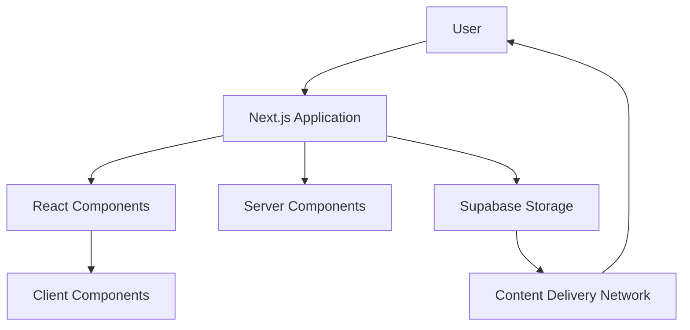
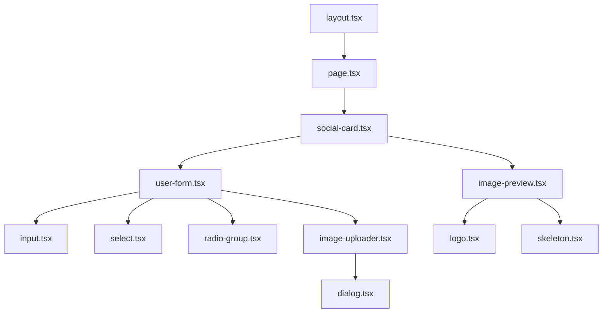
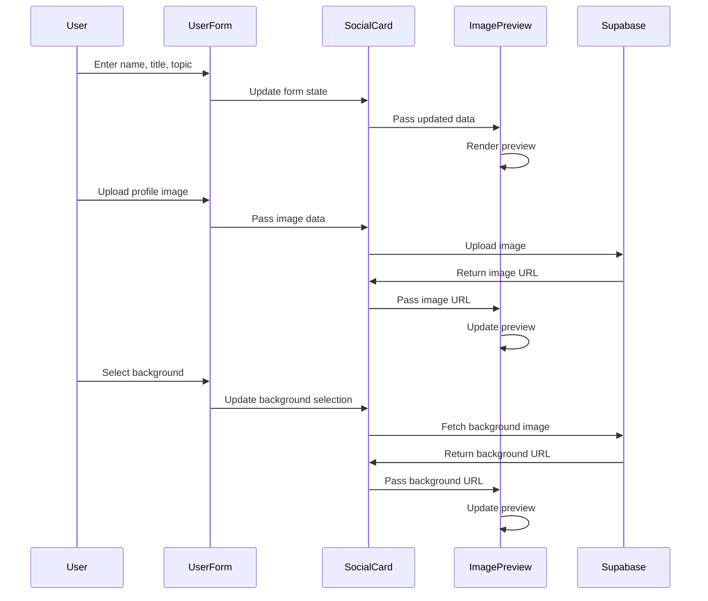
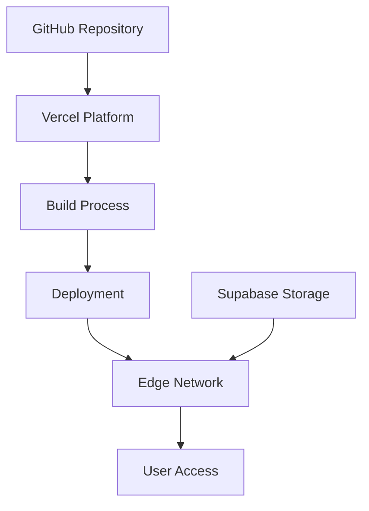

# OIW Social Card Generator - Technical Architecture

This document provides a detailed overview of the technical architecture of the Oslo Innovation Week Social Card Generator application.

## System Overview

The OIW Social Card Generator is a Next.js application that allows users to create personalized social media cards for Oslo Innovation Week 2025. The application follows a client-side architecture with server-side rendering capabilities provided by Next.js.

## Core Technologies

### Frontend Framework
- **Next.js 15**: Provides the foundation for the application with server-side rendering, static site generation, and API routes.
- **React 18**: Used for building the user interface with functional components and hooks.
- **TypeScript**: Ensures type safety throughout the application.

### Styling
- **Tailwind CSS**: Utility-first CSS framework for styling components.
- **shadcn/ui**: Component library built on top of Tailwind CSS.
- **Framer Motion**: Animation library for creating smooth transitions and effects.

### Storage and Backend
- **Supabase Storage**: Used for storing and serving images (backgrounds, logos, and user uploads).
- **Supabase Image Transformation API**: Handles image resizing, optimization, and format conversion.

### Image Processing
- **html-to-image**: Library for converting HTML elements to images.
- **react-image-crop**: Provides image cropping functionality.

## Component Architecture

The application follows a component-based architecture with a clear separation of concerns:

### Key Components

#### Layout Component (`layout.tsx`)
- Serves as the main layout wrapper for the application
- Handles font loading and global styles
- Provides consistent layout across all pages

#### Page Component (`page.tsx`)
- Main entry point for the application
- Renders the SocialCard component
- Handles page-level metadata

#### SocialCard Component (`social-card.tsx`)
- Core component that orchestrates the entire application
- Manages state for user input, background selection, and image preview
- Handles image generation and download functionality
- Coordinates between UserForm and ImagePreview components

#### UserForm Component (`user-form.tsx`)
- Handles user input for name, title, and topic
- Manages form validation and submission
- Provides interface for background selection
- Integrates with ImageUploader component

#### ImageUploader Component (`image-uploader.tsx`)
- Handles image upload functionality
- Provides drag-and-drop interface
- Validates image files for size and format
- Integrates with image cropping functionality

#### ImagePreview Component (`image-preview.tsx`)
- Renders the preview of the generated social card
- Updates in real-time as user makes changes
- Displays loading states during image processing
- Handles responsive layout for different screen sizes

## State Management

The application uses React's built-in state management with hooks:

- **useState**: For component-level state management
- **useEffect**: For side effects like image loading and processing
- **useCallback**: For memoized callback functions
- **useMemo**: For memoized values

Example state flow:

## Data Flow

The application follows a unidirectional data flow:

1. User interacts with the UserForm component
2. UserForm updates state in the SocialCard component
3. SocialCard passes the updated state to the ImagePreview component
4. ImagePreview renders the updated preview

## Asset Management

The application uses Supabase Storage for asset management:

- **Backgrounds**: Stored in the `backgrounds` bucket
- **Logos**: Stored in the `logos` bucket
- **User Uploads**: Temporarily stored for processing

The `storage.ts` utility provides functions for:
- Uploading images to Supabase
- Fetching images from Supabase
- Handling image transformations
- Caching images for improved performance

## Performance Optimizations

The application includes several performance optimizations:

- **Image Optimization**: Using Next.js Image component for automatic optimization
- **Lazy Loading**: Non-critical components are loaded only when needed
- **Code Splitting**: The application is split into smaller chunks for faster loading
- **Font Optimization**: Custom fonts are loaded with proper strategies to prevent layout shifts
- **Caching**: Static assets are cached for improved performance
- **Skeleton Loading**: Loading states are displayed during image processing

## Deployment Architecture

The application is deployed on Vercel with the following architecture:

## Security Considerations

The application implements several security measures:

- **Content Security Policy**: Restricts the sources of content that can be loaded
- **CORS Configuration**: Controls access to resources from different origins
- **Input Validation**: Validates user input to prevent malicious data
- **File Type Validation**: Ensures only allowed file types can be uploaded
- **Size Restrictions**: Limits the size of uploaded files

## Future Architecture Considerations

Potential future enhancements to the architecture:

- **Server-Side API Routes**: For more secure handling of sensitive operations
- **Database Integration**: For storing user data and preferences
- **Authentication**: For user accounts and personalized experiences
- **Analytics Integration**: For tracking usage and performance metrics
- **Service Worker**: For offline support and improved performance
- **WebAssembly**: For more efficient image processing 