# Project Structure Visualization

```mermaid
graph TD
    %% Define colors and styles
    classDef layout fill:#f96,stroke:#333,stroke-width:2px,color:#fff
    classDef page fill:#6cf,stroke:#333,stroke-width:2px,color:#fff
    classDef component fill:#9cf,stroke:#333,stroke-width:1px,color:#000
    classDef utility fill:#fc6,stroke:#333,stroke-width:1px,color:#000
    classDef font fill:#6cf,stroke:#333,stroke-width:1px,color:#000
    classDef ui fill:#c9f,stroke:#333,stroke-width:1px,color:#000

    %% Main application structure
    layout[layout.tsx - Main layout wrapper]:::layout --> fonts[fonts/index.ts - Custom font definitions]:::font
    layout --> page[page.tsx - Main page component]:::page
    
    %% Core components
    page --> socialCard[social-card.tsx - Combines form and preview rendering]:::component
    socialCard --> userForm[user-form.tsx - Handles user input and interactions]:::component
    socialCard --> imagePreview[image-preview.tsx - Displays the generated social card preview]:::component
    
    %% Form components
    userForm --> input[input.tsx - Input field component]:::ui
    userForm --> label[label.tsx - Label component for form fields]:::ui
    userForm --> select[select.tsx - Dropdown select component]:::ui
    userForm --> radioGroup[radio-group.tsx - Radio button group component]:::ui
    userForm --> button[button.tsx - Button component]:::ui
    userForm --> imageUploader[image-uploader.tsx - Handles image upload and cropping]:::component
    
    %% Dialog components
    imageUploader --> dialog[dialog.tsx - Modal dialog component]:::ui
    
    %% Preview components
    imagePreview --> logo[logo.tsx - Logo component]:::component
    imagePreview --> skeleton[skeleton.tsx - Loading placeholder component]:::ui
    
    %% Font definitions
    fonts --> Circular[Circular Fonts - Font family for body text]:::font
    fonts --> PPEditorialNew[PP Editorial New Fonts - Font family for display text]:::font
    
    %% Utility files
    socialCard --> backgrounds[backgrounds.ts - Background image utilities]:::utility
    socialCard --> logos[logos.ts - Logo image utilities]:::utility
    socialCard --> constants[constants.ts - Application-wide constants]:::utility
    socialCard --> storage[storage.ts - Supabase storage utilities]:::utility
    
    %% External libraries
    socialCard --> htmlToImage[html-to-image - Converts HTML elements to images]:::utility
    socialCard --> framerMotion[framer-motion - Animation library]:::utility
    socialCard --> nextImage[next/image - Optimized image component from Next.js]:::utility
    
    %% Background component
    socialCard --> backgroundComponent[background.tsx - Background selection component]:::component
    
    %% UI Components
    subgraph UI Components
        input
        label
        select
        radioGroup
        button
        dialog
        skeleton
    end
    
    %% Core Components
    subgraph Core Components
        socialCard
        userForm
        imagePreview
        imageUploader
        logo
        backgroundComponent
    end
    
    %% Utilities
    subgraph Utilities
        backgrounds
        logos
        constants
        storage
        htmlToImage
        framerMotion
        nextImage
    end
```

## Component Descriptions

### Core Components

- **layout.tsx**: Main layout wrapper that provides the application structure and loads fonts
- **page.tsx**: Main page component that serves as the entry point for the application
- **social-card.tsx**: Core component that orchestrates the entire application flow
- **user-form.tsx**: Handles user input for name, title, and topic selection
- **image-preview.tsx**: Displays the real-time preview of the generated social card
- **image-uploader.tsx**: Manages image upload with drag-and-drop and file selection
- **logo.tsx**: Renders the OIW logo with proper sizing and positioning
- **background.tsx**: Provides background selection functionality

### UI Components

- **input.tsx**: Reusable input field component with validation
- **label.tsx**: Label component for form fields
- **select.tsx**: Dropdown select component for topic selection
- **radio-group.tsx**: Radio button group for option selection
- **button.tsx**: Reusable button component with various styles
- **dialog.tsx**: Modal dialog component for image cropping
- **skeleton.tsx**: Loading placeholder component for better UX

### Utilities

- **backgrounds.ts**: Manages background image options and configurations
- **logos.ts**: Handles logo variations and configurations
- **constants.ts**: Application-wide constants and configuration values
- **storage.ts**: Supabase storage utilities for image management
- **fonts/index.ts**: Custom font definitions and loading strategies

### External Libraries

- **html-to-image**: Converts HTML elements to downloadable images
- **framer-motion**: Animation library for smooth transitions
- **next/image**: Optimized image component from Next.js
